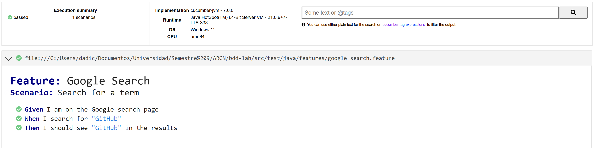

# bdd-lab

Laboratorio básico de pruebas BDD con Cucumber + Selenium + Maven.

## Ejecutar pruebas

```bash
mvn clean test
```

## Reporte HTML de resultados

Al ejecutar las pruebas, el reporte se genera en:

`target/HtmlReports/report.html`

## Pantallazo del reporte


